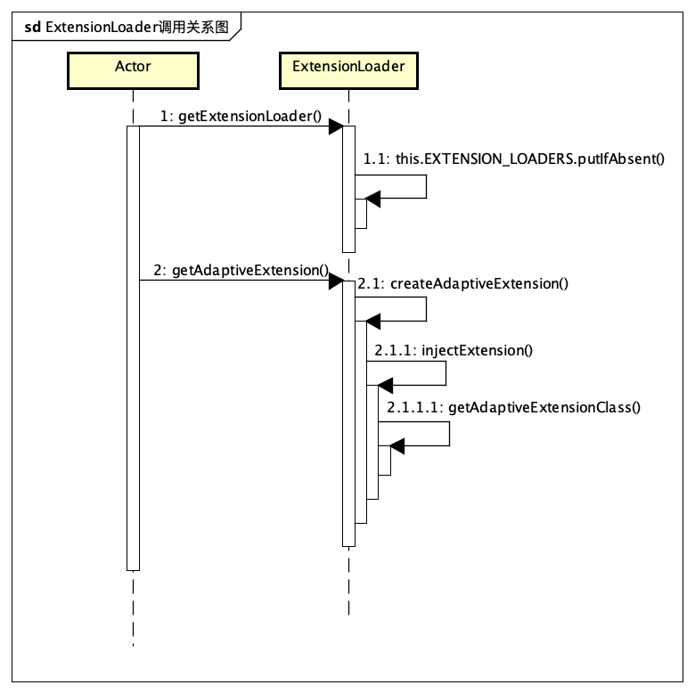

# <center>3. Dubbo的SPI机制</center>

## 1. SPI机制

>SPI 全称为 (Service Pz【 拼音 】ovider Interface) ，是JDK内置的一种服务提供发现机制。SPI是一种动态替换发现的机制，Dubbo重新实现了一套SPI机制，为这个功能扩展了IOC功能及AOP功能。
>
>当服务的提供者提供了一种接口的实现之后，需要在classspath下的META/services/目录里创建一个以服务接口命名的文件 ，这个文件里的内容就是这个接口的具体实现类。当其它的程序需要这个服务的时候，就可以通过查找这个jar包（一般都是以jar包做依赖）的META/services/中的配置文件，配置文件中有接口的具体实现类名，可以根据这个类名进行加载实例化，就可使用该服务了。JDK中查找服务实现的工具类是：java.util.ServiceLoader。


## 2. ExtensionLoader的实现细节

Dubbo扩展了SPI机制，约定Dubbo的扩展文件放在META-INF/dubbo/internal/这个文件夹中，其主要实现方在`ExtensionLoader`中。

一般的使用方法如下：

```java
ExtensionLoader.getExtensionLoadre(ProxyFactory.class).getAdaptiveExtension();
```


此方法主要调用关系图如下图：



下面会对`ExtensionLoader`的代码进行解读：

### 1. 概览

主要有`ExtensionLoader#getExtensionLoader(Class<T> type)`、`ExtensionLoader#getAdaptiveExtension()`两个方法。

1. `ExtensionLoader#getExtensionLoader(Class<T> type)`，需要传入一个带有`@SPI`注解的类，例如： `Protocol.class`。
2. `ExtensionLoader#getAdaptiveExtension()`会自动寻找接口的实现类中的自适应方法。如果没有找到，会创建一个{$interfaceName$}+$Adaptive的新类，做为自适应实现类。


```java
public class ExtensionLoader<T> {
  	//jdk的SPI规范定义的服务文件
    private static final String SERVICES_DIRECTORY = "META-INF/services/";
		
    private static final String DUBBO_DIRECTORY = "META-INF/dubbo/";
		//dubbo的SPI规范定义的服务文件
    private static final String DUBBO_INTERNAL_DIRECTORY = DUBBO_DIRECTORY + "internal/";

    private static final Pattern NAME_SEPARATOR = Pattern.compile("\\s*[,]+\\s*");

  	//ExtensionLoader的缓存
    private static final ConcurrentMap<Class<?>, ExtensionLoader<?>> EXTENSION_LOADERS = new ConcurrentHashMap<>();

  	//Extension的缓存
    private static final ConcurrentMap<Class<?>, Object> EXTENSION_INSTANCES = new ConcurrentHashMap<>();	
  
   public static <T> ExtensionLoader<T> getExtensionLoader(Class<T> type) {
     //.. omitted
   }
  
   public T getAdaptiveExtension() {
  		//.. omitted
   }
}
```


### 2. #getExtensionLoader

1. 入参校验，入参必须是含有`@SPI`注解的接口；
2. 从缓存里面取出ExtensionLoader的实例，如果没有缓存，则新建；
3. 如果需要新建`ExtensionLoader`，需要判断入参是否为`ExtensionFactory.class`，如果不是，则将`ExtensionFactory.class`的自适应实现赋给`objectFactory`;

```java
    public static <T> ExtensionLoader<T> getExtensionLoader(Class<T> type) {
      //1. 参数校验，入参必须是含有@SPI注解的接口  
      if (type == null) {
            throw new IllegalArgumentException("Extension type == null");
        }
        if (!type.isInterface()) {
            throw new IllegalArgumentException("Extension type (" + type + ") is not an interface!");
        }
        if (!withExtensionAnnotation(type)) {
            throw new IllegalArgumentException("Extension type (" + type +
                    ") is not an extension, because it is NOT annotated with @" + SPI.class.getSimpleName() + "!");
        }
				//2. 从缓存里面取出ExtensionLoader的实例，如果没有缓存，则新建
        ExtensionLoader<T> loader = (ExtensionLoader<T>) EXTENSION_LOADERS.get(type);
        if (loader == null) {
          	//3. 注意ExtensionLoader的构造方法是私有的
            EXTENSION_LOADERS.putIfAbsent(type, new ExtensionLoader<T>(type));
            loader = (ExtensionLoader<T>) EXTENSION_LOADERS.get(type);
        }
        return loader;
    }
```

```java
    private ExtensionLoader(Class<?> type) {
        this.type = type;
      	//4. 构造方法是私有的，如果ExtensionLoader不是ExtensionFactory的实现，则需要新建一个工厂类，这个工厂类也是通过ExtensionLoader获得的自适应方法
        objectFactory = (type == ExtensionFactory.class ? null : ExtensionLoader.getExtensionLoader(ExtensionFactory.class).getAdaptiveExtension());
    }

```


### 3. #getAdaptiveExtension

```java
    public T getAdaptiveExtension() {
        //1. 先从缓存中获取自适应扩展的实例
      	Object instance = cachedAdaptiveInstance.get();
      	//2. 如果没有，则通过双重校验锁创建实例的单例
        if (instance == null) {
            if (createAdaptiveInstanceError == null) {
                synchronized (cachedAdaptiveInstance) {
                    instance = cachedAdaptiveInstance.get();
                    if (instance == null) {
                        try {
                          	//3. 创建自适应扩展的实例
                            instance = createAdaptiveExtension();
                            cachedAdaptiveInstance.set(instance);
                        } catch (Throwable t) {
                            createAdaptiveInstanceError = t;
                            throw new IllegalStateException("Failed to create adaptive instance: " + t.toString(), t);
                        }
                    }
                }
            } else {
                throw new IllegalStateException("Failed to create adaptive instance: " + createAdaptiveInstanceError.toString(), createAdaptiveInstanceError);
            }
        }

        return (T) instance;
    }

```

```java
    private T createAdaptiveExtension() {
        try {
          	//4. 先找到自适应扩展的类，再实例化
          	//5. 为创建的实例注入其依赖的扩展实例（即Dubbo自己实现的依赖注入）
            return injectExtension((T) getAdaptiveExtensionClass().newInstance());
        } catch (Exception e) {
            throw new IllegalStateException("Can't create adaptive extension " + type + ", cause: " + e.getMessage(), e);
        }
    }

```

```java
    private Class<?> getAdaptiveExtensionClass() {
        getExtensionClasses();
        if (cachedAdaptiveClass != null) {
            return cachedAdaptiveClass;
        }
        return cachedAdaptiveClass = createAdaptiveExtensionClass();
    }

```

```java
    private Map<String, Class<?>> getExtensionClasses() {
      	//6. 通过双重校验锁获得扩展实现类的类名，并放入缓存
        Map<String, Class<?>> classes = cachedClasses.get();
        if (classes == null) {
            synchronized (cachedClasses) {
                classes = cachedClasses.get();
                if (classes == null) {
                    classes = loadExtensionClasses();
                    cachedClasses.set(classes);
                }
            }
        }
        return classes;
    }

```

```java
    private Map<String, Class<?>> loadExtensionClasses() {
      	//7。 缓存扩展的默认名称，即@SPI里的value()
        cacheDefaultExtensionName();

      	//8. 寻找扩展的路径分别为
      	//META-INF/dubbo/internal/
      	//META-INF/dubbuo/
      	//META-INF/services/
      	//同时，这一步还兼容了旧包名
        Map<String, Class<?>> extensionClasses = new HashMap<>();
        loadDirectory(extensionClasses, DUBBO_INTERNAL_DIRECTORY, type.getName());
        loadDirectory(extensionClasses, DUBBO_INTERNAL_DIRECTORY, type.getName().replace("org.apache", "com.alibaba"));
        loadDirectory(extensionClasses, DUBBO_DIRECTORY, type.getName());
        loadDirectory(extensionClasses, DUBBO_DIRECTORY, type.getName().replace("org.apache", "com.alibaba"));
        loadDirectory(extensionClasses, SERVICES_DIRECTORY, type.getName());
        loadDirectory(extensionClasses, SERVICES_DIRECTORY, type.getName().replace("org.apache", "com.alibaba"));
        return extensionClasses;
    }

```

```java
    private Class<?> createAdaptiveExtensionClass() {
      	//9. 通过代码接接一个新的类的内容
        String code = new AdaptiveClassCodeGenerator(type, cachedDefaultName).generate();
      	//10. 找到ExtensionLoader的classLoader
      	ClassLoader classLoader = findClassLoader();
      	//11. 拿到org.apache.dubbo.common.compiler.Compiler的自适应扩展
        org.apache.dubbo.common.compiler.Compiler compiler = ExtensionLoader.getExtensionLoader(org.apache.dubbo.common.compiler.Compiler.class).getAdaptiveExtension();
      	//12. 通过classLoader和拼接出来的code内容，生成一个新类
        return compiler.compile(code, classLoader);
    }

```

```java
public class AdaptiveClassCodeGenerator {
		//.. omitted
  	//13. 自适应的类会扩展接口的名字加上$Adaptiver,做为自适应类的类名
    private static final String CODE_CLASS_DECLARATION = "public class %s$Adaptive implements %s {\n";
		//.. omitted
	}
```

```java
public abstract class AbstractCompiler implements Compiler {

    private static final Pattern PACKAGE_PATTERN = Pattern.compile("package\\s+([$_a-zA-Z][$_a-zA-Z0-9\\.]*);");

    private static final Pattern CLASS_PATTERN = Pattern.compile("class\\s+([$_a-zA-Z][$_a-zA-Z0-9]*)\\s+");

    @Override
    public Class<?> compile(String code, ClassLoader classLoader) {
        code = code.trim();
      	//14. 通过正则找到package
        Matcher matcher = PACKAGE_PATTERN.matcher(code);
        String pkg;
        if (matcher.find()) {
            pkg = matcher.group(1);
        } else {
            pkg = "";
        }
      	//15. 通过正则找到class
        matcher = CLASS_PATTERN.matcher(code);
        String cls;
        if (matcher.find()) {
            cls = matcher.group(1);
        } else {
            throw new IllegalArgumentException("No such class name in " + code);
        }
      	//16. 拼接className
        String className = pkg != null && pkg.length() > 0 ? pkg + "." + cls : cls;
        try {
          	//17. 尝试通过反射找到类
            return Class.forName(className, true, org.apache.dubbo.common.utils.ClassUtils.getCallerClassLoader(getClass()));
        } catch (ClassNotFoundException e) {
          	//18. 反射失败，先检查代码是否以 } 结尾
            if (!code.endsWith("}")) {
                throw new IllegalStateException("The java code not endsWith \"}\", code: \n" + code + "\n");
            }
            try {
              	//19. 通过compiler生成一个新的类。通常我们使用JavassistCompiler
                return doCompile(className, code);
            } catch (RuntimeException t) {
                throw t;
            } catch (Throwable t) {
                throw new IllegalStateException("Failed to compile class, cause: " + t.getMessage() + ", class: " + className + ", code: \n" + code + "\n, stack: " + ClassUtils.toString(t));
            }
        }
    }

    protected abstract Class<?> doCompile(String name, String source) throws Throwable;

}

```

```java
public class JavassistCompiler extends AbstractCompiler {

    private static final Pattern IMPORT_PATTERN = Pattern.compile("import\\s+([\\w\\.\\*]+);\n");

    private static final Pattern EXTENDS_PATTERN = Pattern.compile("\\s+extends\\s+([\\w\\.]+)[^\\{]*\\{\n");

    private static final Pattern IMPLEMENTS_PATTERN = Pattern.compile("\\s+implements\\s+([\\w\\.]+)\\s*\\{\n");

    private static final Pattern METHODS_PATTERN = Pattern.compile("\n(private|public|protected)\\s+");

    private static final Pattern FIELD_PATTERN = Pattern.compile("[^\n]+=[^\n]+;");

    @Override
    public Class<?> doCompile(String name, String source) throws Throwable {
        //20. 将类抽象成了一个POJO，通过javassist生成一个新类
      	CtClassBuilder builder = new CtClassBuilder();
        builder.setClassName(name);

        // process imported classes
        Matcher matcher = IMPORT_PATTERN.matcher(source);
        while (matcher.find()) {
            builder.addImports(matcher.group(1).trim());
        }

        // process extended super class
        matcher = EXTENDS_PATTERN.matcher(source);
        if (matcher.find()) {
            builder.setSuperClassName(matcher.group(1).trim());
        }

        // process implemented interfaces
        matcher = IMPLEMENTS_PATTERN.matcher(source);
        if (matcher.find()) {
            String[] ifaces = matcher.group(1).trim().split("\\,");
            Arrays.stream(ifaces).forEach(i -> builder.addInterface(i.trim()));
        }

        // process constructors, fields, methods
        String body = source.substring(source.indexOf('{') + 1, source.length() - 1);
        String[] methods = METHODS_PATTERN.split(body);
        String className = ClassUtils.getSimpleClassName(name);
        Arrays.stream(methods).map(String::trim).filter(m -> !m.isEmpty()).forEach(method -> {
            if (method.startsWith(className)) {
                builder.addConstructor("public " + method);
            } else if (FIELD_PATTERN.matcher(method).matches()) {
                builder.addField("private " + method);
            } else {
                builder.addMethod("public " + method);
            }
        });

        // compile
        ClassLoader classLoader = org.apache.dubbo.common.utils.ClassUtils.getCallerClassLoader(getClass());
        CtClass cls = builder.build(classLoader);
        return cls.toClass(classLoader, JavassistCompiler.class.getProtectionDomain());
    }

}

```

```java
    private T injectExtension(T instance) {
        try {
            if (objectFactory != null) {
                for (Method method : instance.getClass().getMethods()) {
                  	//21. Dubbo版本的依赖注入，是通过setter方法判断是否需要注入
                    if (isSetter(method)) {
                        /**
                         * Check {@link DisableInject} to see if we need auto injection for this property
                         */
                        if (method.getAnnotation(DisableInject.class) != null) {
                            continue;
                        }
                        Class<?> pt = method.getParameterTypes()[0];
                        if (ReflectUtils.isPrimitives(pt)) {
                            continue;
                        }
                        try {
                            String property = getSetterProperty(method);
                            Object object = objectFactory.getExtension(pt, property);
                            if (object != null) {
                                method.invoke(instance, object);
                            }
                        } catch (Exception e) {
                            logger.error("Failed to inject via method " + method.getName()
                                    + " of interface " + type.getName() + ": " + e.getMessage(), e);
                        }
                    }
                }
            }
        } catch (Exception e) {
            logger.error(e.getMessage(), e);
        }

        return instance;
    }

```

## 3. 常用的ExtensionLoader

主要有三种类型的`ExtensionLoader`

### 1. Compiler

`Compiler`有两个实现，分别是`JavassistCompiler`、`JdkCompiler`。另外还有一个自适应的实现`AdaptiveComiler`。

```java
@Adaptive
public class AdaptiveCompiler implements Compiler {

    private static volatile String DEFAULT_COMPILER;

    public static void setDefaultCompiler(String compiler) {
        DEFAULT_COMPILER = compiler;
    }

    @Override
    public Class<?> compile(String code, ClassLoader classLoader) {
        Compiler compiler;
        ExtensionLoader<Compiler> loader = ExtensionLoader.getExtensionLoader(Compiler.class);
        String name = DEFAULT_COMPILER; // copy reference
        if (name != null && name.length() > 0) {
          	//1. 通过传入Compiler的名称，得到指定的compiler，类似compiler的工厂类
            compiler = loader.getExtension(name);
        } else {
            compiler = loader.getDefaultExtension();
        }
        return compiler.compile(code, classLoader);
    }

}

```


### 2. ExtensionFactory

`ExtensionFactory`有三个实现类：


1. `AdaptiveExtensionFactory`

   ```java
   @Adaptive
   public class AdaptiveExtensionFactory implements ExtensionFactory {
   
       private final List<ExtensionFactory> factories;
   
       public AdaptiveExtensionFactory() {
           ExtensionLoader<ExtensionFactory> loader = ExtensionLoader.getExtensionLoader(ExtensionFactory.class);
           List<ExtensionFactory> list = new ArrayList<ExtensionFactory>();
           for (String name : loader.getSupportedExtensions()) {
               list.add(loader.getExtension(name));
           }
           factories = Collections.unmodifiableList(list);
       }
   
       @Override
       public <T> T getExtension(Class<T> type, String name) {
           for (ExtensionFactory factory : factories) {
             	//1. 遍历所有的工厂类，从工厂中生产出指定类型的扩展。有点类似工厂类的门面
               T extension = factory.getExtension(type, name);
               if (extension != null) {
                   return extension;
               }
           }
           return null;
       }
   
   }
   ```

   

2. `SpiExtensionFactory`

   这个类是用来生产SpiExtension的，是扩展的工厂类。这个类通过调用前面提到的`ExtensionLoader`的方法，生产扩展的实例。具体过程不在缀述。

   

3. `SpringExtensionFactory`

   由于Dubbo与Spring进行了尝试整合。Dubbo也需要管理Spring的Bean。

   ```java
   public class SpringExtensionFactory implements ExtensionFactory {
     
     	//.. omitted
     
       @Override
       @SuppressWarnings("unchecked")
       public <T> T getExtension(Class<T> type, String name) {
   
           //SPI should be get from SpiExtensionFactory
           if (type.isInterface() && type.isAnnotationPresent(SPI.class)) {
               return null;
           }
   
           for (ApplicationContext context : CONTEXTS) {
               if (context.containsBean(name)) {
                 	//1. 通过ApplicatonContext的上下文管理Bean
                   Object bean = context.getBean(name);
                   if (type.isInstance(bean)) {
                       return (T) bean;
                   }
               }
           }
   
           logger.warn("No spring extension (bean) named:" + name + ", try to find an extension (bean) of type " + type.getName());
   
           if (Object.class == type) {
               return null;
           }
   
           for (ApplicationContext context : CONTEXTS) {
               try {
                   return context.getBean(type);
               } catch (NoUniqueBeanDefinitionException multiBeanExe) {
                   logger.warn("Find more than 1 spring extensions (beans) of type " + type.getName() + ", will stop auto injection. Please make sure you have specified the concrete parameter type and there's only one extension of that type.");
               } catch (NoSuchBeanDefinitionException noBeanExe) {
                   if (logger.isDebugEnabled()) {
                       logger.debug("Error when get spring extension(bean) for type:" + type.getName(), noBeanExe);
                   }
               }
           }
   
           logger.warn("No spring extension (bean) named:" + name + ", type:" + type.getName() + " found, stop get bean.");
   
           return null;
       }
   
     	//.. omitted
   }
   ```

   

### 3. 普通的Extension

其余的扩展，均通过ExtensionFactory来管理。


## 4. 总结 

1. `Dubbo`通过扩展`SPI`机制，获得了高扩展性；
2. 通过在指定目录添加文件可以注册新的扩展；
3. 自适应扩展可以通过`@Adaptive`来标定。`@Adaptive`放在类上是，可直接指定为自适应实现类。系统中目前有两个`AdaptiveCompiler`、`AdaptiveExtensionFactory`。`@Adaptive`亦可放在方法上，这样Dubbo会动态生成一个$Adaptive的类做为自适应实现类。
4. `Dubbo`通过`setter`方法来识别并注入扩展的依赖。